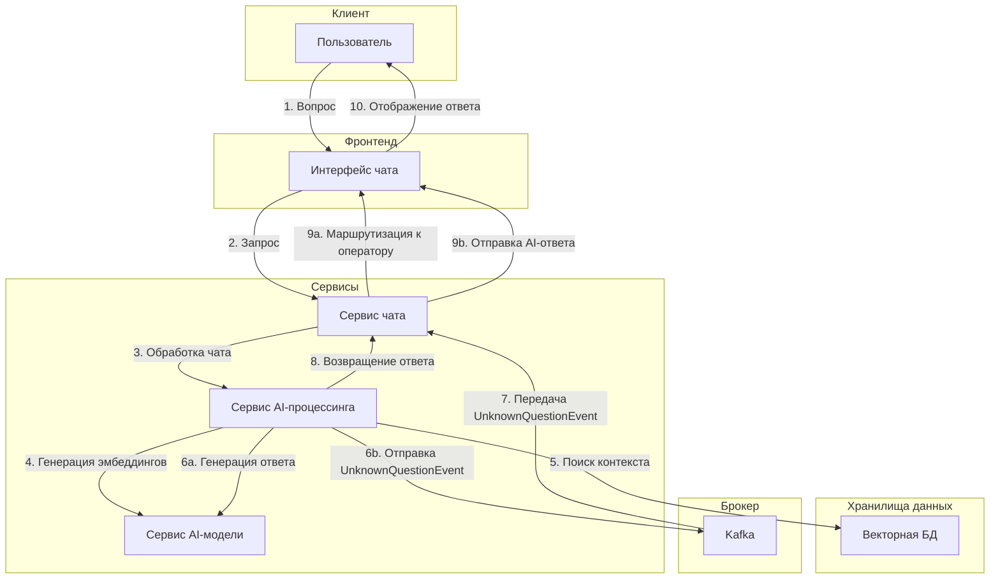

# Архитектура высокого уровня для внутренней системы автоматизации поддержки клиентов

## Описание системы

Система состоит из следующих компонентов:

1. **Векторная база данных** - хранение знаний о компании и продуктах
2. **Сервис AI модели** - API endpoint для генерации эмбеддинг-векторов и обработки вопросов
3. **Сервис чата** - обработка сообщений с ресурса и маршрутизация между AI сервисом и живыми операторами
4. **Сервис AI-процессинга вопросов** - генерация ответов на вопросы с использованием базы знаний и языковой модели (реализованный пример в данном репозитории)

## Архитектура системы

Проект построен на многослойной архитектуре с четким разделением ответственности между компонентами и изоляцией бизнес-логики от инфраструктуры. Взаимодействие через абстрактные интерфейсы обеспечивает гибкость при замене технологий и упрощает тестирование компонентов.

## Процесс обработки запроса

1. На endpoint `v1/ai-assist` поступает GET-запрос с параметрами:

   - `chat_id` - идентификатор чата
   - `text` - текст вопроса пользователя

2. Вызывается функция сервиса `ProcessQuestion`, которая работает по следующему алгоритму:

   a. **Генерация эмбеддинга** - создание векторного представления для вопроса пользователя через API OpenAI (возможно использование альтернативных решений)

   b. **Поиск релевантной информации** - запрос к векторной базе данных (в примере используется PostgreSQL с расширением для векторного поиска, но можно интегрировать любое другое решение)

   c. **Обработка результатов поиска**:

   - Если релевантная информация найдена, формируется контекст из полученных данных
   - Если информация не найдена, отправляется событие в Kafka с идентификатором чата (`chat_id`), чтобы уведомить сервисы о необходимости переключения на живого оператора

   d. **Генерация ответа** - формирование ответа пользователю с помощью API OpenAI на основе найденного контекста (возможно использование альтернативных решений)

   e. **Возврат результата** - пользователю предоставляется сгенерированный ответ или уведомление о переключении на живого оператора поддержки

## Технические особенности

- Масштабируемость - каждый компонент системы может быть независимо масштабирован
- Гибкость интеграций - возможность замены провайдера AI-моделей (OpenAI на альтернативные решения)
- Отказоустойчивость - асинхронное взаимодействие через Kafka для критически важных уведомлений
- Расширяемость - возможность добавления новых функций без изменения существующего кода

Данный репозиторий содержит реализацию сервиса AI-процессинга вопросов, который является ключевым компонентом описанной системы. Большая часть функциональности в текущей версии представлена заглушками, которые демонстрируют архитектуру и потоки данных без полной реализации бизнес-логики.

### Диаграмма процесса обработки запроса сервисом

